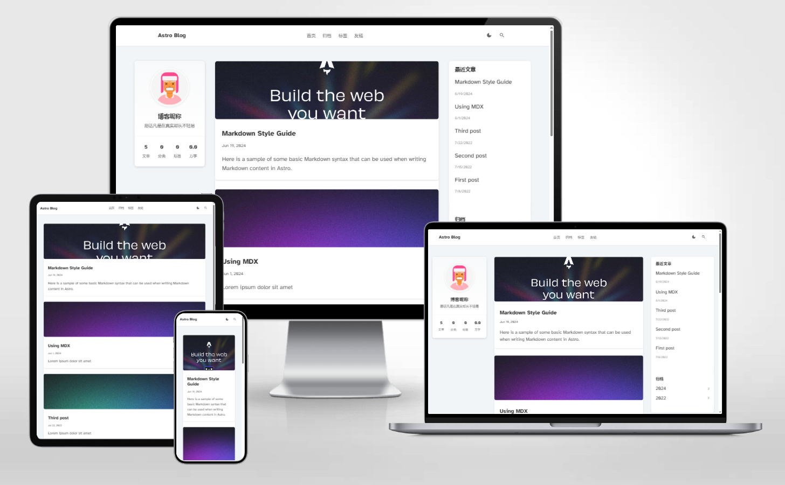

# 🏝️ Astro Theme IsolatedLand

A minimal and elegant blog theme built with Astro.

> ⚠️ **Note**: This theme is still under development and not yet available in the official Astro theme showcase.

## 🖥️ Preview

[](https://isolatedland.vercel.app/)

## ✨ Features

- ✅ Responsive Design
- ✅ SEO Optimized
- ✅ Markdown & MDX Support
- ✅ Calendar Component
- ✅ Todo List
- ✅ Customizable Sidebar
- ✅ RSS Feed Support
- ✅ Sitemap Support

## ⚡ Performance

- 100/100 Lighthouse Score
- Fast Page Loading
- Optimized Asset Loading

## 📦 Quick Start

> ⚠️ Currently, you need to clone the repository and run it locally:

```bash
# Clone the repository
git clone https://github.com/JIeJaitt/astro-theme-isolatedland.git

# Navigate to the directory
cd astro-theme-isolatedland

# Install dependencies
npm install

# Start development server
npm run dev
```

## 🚀 Project Structure

```text
├── public/
├── src/
│   ├── components/
│   │   ├── sidebar/
│   │   ├── Footer.astro
│   │   └── ...
│   ├── content/
│   ├── layouts/
│   └── pages/
├── astro.config.mjs
├── README.md
├── package.json
└── tsconfig.json
```

## 🔧 Configuration

1. Theme settings: Modify `src/config/theme.ts`
2. Sidebar settings: Edit corresponding sidebar components
3. Content: Create posts in `src/content/` directory

## 📝 Usage

### Post Frontmatter

| Field       | Description | Required |
|-------------|-------------|----------|
| title       | Post title  | Yes      |
| pubDate     | Publish date| Yes      |
| description | Description | Yes      |
| image       | Cover image | No       |
| tags        | Post tags   | No       |

## 🛠️ Commands

| Command                | Action                                  |
|-----------------------|-----------------------------------------|
| `npm install`         | Install dependencies                    |
| `npm run dev`         | Start dev server at `localhost:4321`    |
| `npm run build`       | Build production site to `./dist/`      |
| `npm run preview`     | Preview production build locally        |

## 📄 License

MIT License © 2024-PRESENT [JIeJaitt](https://github.com/JIeJaitt)

## 💖 Credits

Built with [Astro](https://astro.build/)

[简体中文](./docs/README.zh-CN.md)
